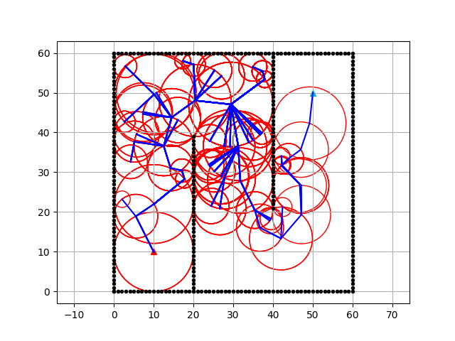

# Wavefront for path planning

This is an implementation of the Wavefront algorithm[[1]](#1)[[2]](#2) for my study.

> **Note**
> I have modified some steps.

> **Warning**
> The implementation may contain mistakes.

## Usage

```
$ python src/main.py
```



## References

<a id="1">[1]</a> Brock, Oliver, and Lydia E. Kavraki. "Decomposition-based motion planning: A framework for real-time motion planning in high-dimensional configuration spaces." Proceedings 2001 ICRA. IEEE International Conference on Robotics and Automation (Cat. No. 01CH37164). Vol. 2. IEEE, 2001.

<a id="2">[2]</a> Rickert, Markus, Arne Sieverling, and Oliver Brock. "Balancing exploration and exploitation in sampling-based motion planning." IEEE Transactions on Robotics 30.6 (2014): 1305-1317.

